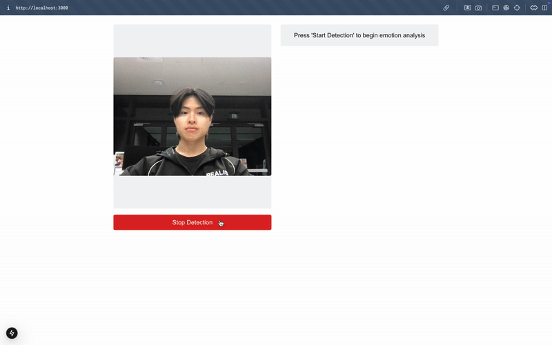

# Real-Time Expression Analysis Coach
AI-powered facial emotion analysis application that provides real-time coaching for approachable appearance, built using Next.JS (frontend) and Django (backend).

# Table of Contents
1. [Installation](#installation)
2. [Demonstration](#demonstration)
3. [Design Rationale](#design-rationale)

## Installation
Download (`git clone`) this repo to run this project locally.
```
> git clone https://github.com/anthonykimm/emotion-detector.git
```

There are 2 components to this project: the frontend and the backend.
To start up the frontend server:
```
> cd frontend
> npm install                       -- install required dependencies
> npm run dev                       -- start up the Next.js server
```
A _`localhost`_ server should be booted up (default port **`3000`**).

To start the backend server:
(new terminal window)
```
> cd backend
> python -m pyenv                   -- create python virtual environment
> pip install requirements.txt      -- install required dependencies
> python manage.py runserver        -- start up the Django server
```
Another _`localhost`_ server should be booted up (default port **`8000`**).

Set up is complete! Head over to `http://localhost:<port number>` (Port number usually **`3000`**).

## Demonstration


## Design Rationale
Although appearance isn't everything, appearing approachable can significantly impact interactions and opportunities. I'm not talking about
just looking pretty, but rather being open, friendly, and approachable. This is important as it can lead to better communication, networking, and
overall positive social experiences. A small problem of mine was that I would sometimes receive feedback
that I looked unapproachable (not in a hurtful way). This led me to create this application that provides real-time feedback on facial expressions.

Few problems that I have identified personally are:

> [!NOTE]
> **Lack of awareness**: I'm not always aware how others perceive me.
> - Solution: Real-time feedback on facial expressions can help me understand how I'm being perceived.

> [!NOTE]
> **Inconsistency**: My appearance can be inconsistent, leading to mixed signals.
> - Solution: Consistent feedback can help me maintain a consistent appearance.

> [!NOTE]
> **Subjectivity**: Perceptions of approachability can vary from person to person.
> - Solution: Provide possible interpretations of facial expressions (to be implemented).

Pre-trained models through `DeepFace` and `OpenCV` libraries were used to analyze facial expressions. Established models ensured reliability and in return I was able to focus
on the user experience. The application provides real-time feedback on the user's facial expression at 500ms intervals to save resources and provide effecient feedback.
Based on each emotions (happy, sad, angry, disgust, fear, surprise, neutral) scores, a "approachability score" is calculated with different weights for each emotion.

Future implementations include:
- Providing different interpretations of facial expressions.
- Speech analysis to provide feedback on tone and volume.
- Mock interviews to practice approachability in a professional setting.
- User profiles to track progress and provide personalised feedback.
